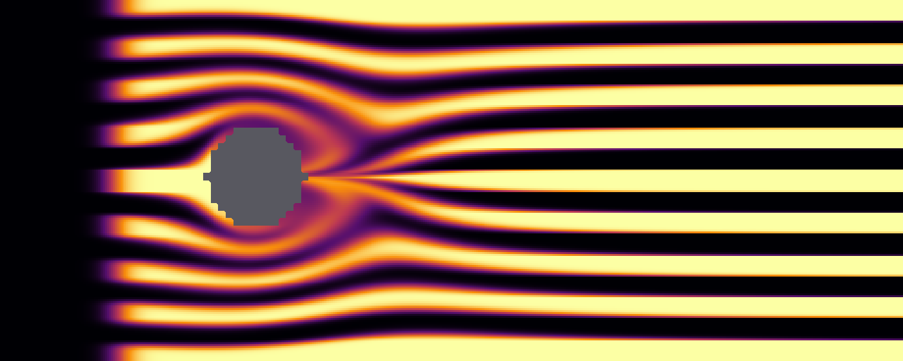

# Soufflerie numérique

Projet fil rouge de la formation **« Découverte du langage Rust pour le calcul
scientifique »**.

On construit, étape par étape, un petit code de calcul complet : lecture d'un domaine,
génération d'un maillage non structuré, transport d'un traceur passif autour d'un
obstacle, écriture des résultats en VTK et en PNG. Le sujet est modeste, le chemin ne
l'est pas : c'est celui de n'importe quel code de calcul, en réduction.

**Le modèle**, en une ligne : fluide parfait — incompressible, irrotationnel, non
visqueux, stationnaire — avec **glissement** aux parois et aux obstacles, et un traceur
passif transporté par cet écoulement. Donc pas de couche limite, pas de sillage, pas de
traînée : ni pression ni quantité de mouvement n'apparaissent dans le calcul.



<sub>`cargo run --release -- domains/tunnel.dom --refine 4 --bands 9 --max-steps 960`</sub>

## Démarrage

Ce dépôt contient le **code complet**. Pour le construire vous-même, engendrez votre
dossier de travail : les passages à écrire y deviennent des `todo!()`, tout le reste est
fourni.

```shell
cargo xtask starter    # crée travail/ (30 trous à combler)
cd travail
cargo test             # quatre tests rouges : l'étape 0 vous attend
```

À partir de là, la boucle est toujours la même :

```shell
cargo test             # rouge : chaque échec nomme le fichier et la ligne
#   ... lire docs/etapes/etape-00.md, remplacer le todo!() entre >>> et <<< ...
cargo test             # vert
cargo xtask goto 1     # étape suivante
```

`cargo test` ne montre que les étapes déjà ouvertes : quatre tests rouges au démarrage,
pas quarante. `cargo xtask status` dit où vous en êtes ; `cargo xtask solve <n>` remplit
une étape à votre place si vous décrochez, `reset <n>` la rouvre. `goto` **n'écrase
jamais** ce que vous avez écrit : il ne complète que les blocs restés vides.

Le déroulé complet est dans [`ETAPES.md`](ETAPES.md), les énoncés dans
[`docs/etapes/`](docs/etapes/) — commencez toujours par lire celui de l'étape en cours.

Et si vous voulez seulement voir tourner la version finie, depuis ce dépôt-ci :

```shell
cargo test                                # tout est vert
cargo run --release -- domains/tunnel.dom # écrit out/frame_XXXX.png et .vtk
open out/frame_0010.png                   # ou paraview out/frames.vtk.series
```

Quelques options utiles :

```shell
cargo run --release -- domains/tunnel.dom \
    --max-steps 800 --every 20 \
    --refine 4 \             # subdivise chaque case en 4×4 : le vrai raffinement
    --bands 9 \              # densité du rideau de fumée
    --circulation 4 \        # dissymétrie de l'écoulement (effet Magnus)
    --diffusivity 0.02 \     # diffusion physique du traceur
    --flow computed \        # résout l'écoulement sur le maillage (étape 12)
    --max-time 60 \          # plafond en temps simulé, en secondes
    --every-dt 0.5           # une image toutes les 0,5 s de temps physique
```

`--refine` est le seul moyen d'augmenter la résolution : c'est le masque qui fixe le
nombre de cellules. `--cell-size` ne règle que la *taille* d'une cellule, donc la taille physique
du domaine — le diviser par deux redonne exactement la même image, sur un domaine deux
fois plus petit.

Et un second masque, `domains/tunnel-empty.dom`, une veine vide : combiné à `--angle`,
il sert à isoler la diffusion numérique du schéma, sans obstacle pour brouiller la
lecture (voir la fin de l'énoncé de l'étape 5).

`--help` liste le reste.

## Prérequis

- Rust ≥ 1.90 (`rustup update stable`)
- rien d'autre : deux dépendances, `image` pour encoder les PNG et `rayon` pour
  l'étape 9
- pour l'étape 11 seulement, une implémentation de MPI (`brew install open-mpi`,
  `apt install libopenmpi-dev`). Elle n'est utilisée que par le crate `mpi/`, exclu du
  workspace : sans elle, tout le reste se construit et se teste normalement.

En réseau isolé, `cargo vendor` permet de récupérer les dépendances à l'avance.

## Le domaine

`domains/tunnel.dom` est un fichier texte que vous pouvez modifier avec n'importe quel
éditeur : `.` pour du fluide, `#` pour du solide, `%` pour un commentaire.

```text
% une veine et son obstacle
...........
....###....
....###....
...........
```

Le maillage en est déduit : une cellule par case de fluide, et un chanfrein à 45° là où
deux parois perpendiculaires se rejoignent — d'où un maillage réellement mixte,
triangles et quadrangles.

Attention : l'écoulement porteur analytique est celui d'un **cylindre**. Si vous
redessinez l'obstacle, gardez-le rond — ou calculez l'écoulement sur votre géométrie avec
`--flow computed` (étape 12), et comparez :

```shell
cargo run --release -- domains/square.dom --refine 2 --max-time 60 --every-dt 0.5 --out out/ana
cargo run --release -- domains/square.dom --refine 2 --max-time 60 --every-dt 0.5 --out out/calc --flow computed
```

Les deux calculs n'ont pas le même pas de temps : la CFL le déduit du débit maximal, et
l'écoulement calculé accélère davantage dans les passages. Comparer à `--max-steps` égal
compare donc deux instants différents. D'où les deux options en temps physique :

- **`--max-time <s>`** plafonne la durée simulée. Donné seul, il est le seul plafond — le
  défaut de `--max-steps` ne s'y substitue pas, sans quoi `--max-time 60` s'arrêterait au
  bout de 600 pas, qui ne font pas 60 secondes. Donnez les deux et le calcul s'arrête au
  premier atteint, `--max-steps` servant alors de garde-fou : on ne sait pas d'avance
  combien de pas coûtera une durée donnée.
- **`--every-dt <s>`** sort les images à date physique fixe, et non tous les *n* pas.

Les deux séries ont alors le même nombre d'images, aux mêmes dates, à un pas de temps près.

## Ce que contient une sortie

Un calcul écrit trois choses dans `--out` :

- `frame_XXXX.vtk` — le maillage et ses champs, une image par sortie ;
- `frame_XXXX.png` — la même image, en couleurs, sans rien installer ;
- `frames.vtk.series` — la liste des images et **leur date**.

**Dans ParaView, ouvrez `frames.vtk.series`, pas les `frame_*.vtk`.** C'est lui qui porte
les dates ; sans lui, ParaView numérote les images 0, 1, 2… et deux calculs de pas de temps
différents ne se superposent pas.

### Les champs d'un fichier VTK

| Champ                        | Support     | Unité   | Ce que c'est                                                                                                                                                   |
|------------------------------|-------------|---------|----------------------------------------------------------------------------------------------------------------------------------------------------------------|
| `c`                          | cellules    | —       | le traceur, la fumée. Part de [0, 1] et y reste avec `--scheme upwind` : c'est une propriété du schéma. `centered` en sort, et c'est tout l'objet de l'étape 6 |
| `psi`                        | **sommets** | m²/s    | la fonction de courant. Ses isolignes **sont** les lignes de courant, et la différence entre deux points est le débit qui passe entre eux                      |
| `u`                          | cellules    | m/s     | la vitesse, vecteur 2D (troisième composante nulle, ParaView veut trois)                                                                                       |
| `speed`                      | cellules    | m/s     | la norme de `u`, pour colorier sans passer par un filtre                                                                                                       |
| `TIME`, `TimeValue`, `CYCLE` | fichier     | s, s, — | la date de l'image et son numéro de pas                                                                                                                        |

Quatre choses à savoir avant d'en tirer un chiffre :

- **`u` et `speed` sont reconstruits** à partir des débits de face, pas échantillonnés :
  c'est une moyenne par cellule, exacte pour un écoulement uniforme et d'ordre 2 sinon. Le
  solveur, lui, ne manipule que des débits — il n'a jamais besoin d'une vitesse ;
- **`psi` est définie à une constante près.** Ses valeurs absolues ne veulent rien dire,
  seules leurs différences en ont un sens. Ici la paroi basse vaut 0, la paroi haute le
  débit total de la veine ;
- **le numéro d'image n'est pas un pas de temps** : avec `--every-dt`, ce n'est qu'un rang
  dans la série. La date est dans le fichier, et dans le `.series` ;
- **l'échelle de couleur du PNG est fixée à [0, 1]** sur le traceur, et le gris neutre du
  fond est le solide — une couleur volontairement étrangère à la palette, pour qu'un vide
  ne se confonde pas avec une valeur faible. Deux images, de deux calculs différents, se
  comparent donc directement, ce qu'une échelle automatique interdirait.

### Trois lectures dans ParaView

Recettes vérifiées sur ParaView 6.1.1. Le point à retenir avant tout : **`u` et `speed`
sont aux cellules, `psi` aux sommets.** La plupart des filtres veulent des données aux
points, d'où le filtre de conversion en tête de deux des trois recettes.

**Les lignes de courant — `Contour` sur `psi`.** C'est la lecture la plus utile, et la
seule exacte.

1. *Filters ▸ Common ▸ Contour*, *Contour By* : `psi` ;
2. donnez des isovaleurs **également espacées** : 4, 8, 12… jusqu'au débit total de la
   veine, soit `--speed × hauteur` (48 pour le domaine livré à vitesse 1).

Deux raisons de la préférer au *Stream Tracer* :

- ce sont les lignes de courant **exactes** — les isolignes elles-mêmes, sans intégration
  de trajectoire, donc sans erreur d'intégration ni pas à régler ;
- à espacement constant en `psi`, **chaque tube transporte le même débit**. Là où les
  lignes se resserrent, le fluide accélère : la vitesse se lit dans la géométrie du tracé.
  C'est ce qui rend le blocage évident.

**Les flèches — `Cell Centers` puis `Glyph`.** `Glyph` attend des points ; `Cell Centers`
en fabrique un par cellule, à l'endroit exact où la valeur a été calculée, sans
interpolation.

1. *Filters ▸ Alphabetical ▸ Cell Centers* ;
2. dessus, *Filters ▸ Common ▸ Glyph* : *Glyph Type* `Arrow`, *Orientation Array* `u`,
   *Scale Array* `u` (longueur ∝ vitesse) ou `No scale array` (flèches égales, souvent
   plus lisible), *Scale Factor* ≈ 0,5 pour commencer ;
3. *Glyph Mode* : `Every Nth Point` avec un *Stride* de l'ordre de 40, ou `Uniform Spatial
   Distribution` — sans quoi vous obtenez une flèche par cellule, soit 22 504 à
   `--refine 2`, et un écran noir ;
4. coloriez le `Glyph` par `speed`.

**La texture — `Surface LIC`.** Très parlante en cours, mais elle exige un vecteur aux
*points* : appliquée directement, elle échoue sur « *Attempt to get an input array for an
index that has not been specified* ».

1. *Filters ▸ Alphabetical ▸ Cell Data to Point Data* ;
2. sur ce filtre, *Representation* : **Surface LIC** ;
3. dans les propriétés, section *Surface LIC*, réglez **Vectors** sur `u`.

Les valeurs y sont interpolées aux sommets : bon pour illustrer, pas pour mesurer.

Enfin, inutile de passer par un *Calculator* pour la norme de la vitesse : `speed` est
déjà dans le fichier.

## Organisation

```text
masque ASCII ──▶ mask ──▶ mesh ──▶ field ──▶ solver ──▶ io ──▶ PNG / VTK
                                     ▲          ▲
                               velocity       flux
```

| Fichier                | Rôle                                                    |
|------------------------|---------------------------------------------------------|
| `src/geom.rs`          | points, vecteurs, aires, centroïdes                     |
| `src/mask.rs`          | lecture et validation du domaine                        |
| `src/mesh.rs`          | cellules, faces, connectivité                           |
| `src/field.rs`         | un champ scalaire aux cellules                          |
| `src/velocity.rs`      | écoulements porteurs analytiques                        |
| `src/flux.rs`          | schémas de flux                                         |
| `src/solver.rs`        | boucle en temps, CFL, conditions aux limites            |
| `src/io/`              | sorties VTK et PNG                                      |
| `src/error.rs`         | les deux familles d'erreurs                             |
| `src/app.rs`           | montage d'un cas, partagé par les deux exécutables      |
| `src/stream.rs`        | fonction de courant résolue sur le maillage (étape 12)  |
| `src/decomposition.rs` | découpage en bandes pour le calcul distribué (étape 11) |
| `mpi/`                 | le pilote MPI, crate à part (étape 11)                  |

Et à côté du code lui-même :

| Chemin                       | Rôle                                                               |
|------------------------------|--------------------------------------------------------------------|
| `ETAPES.md`                  | le déroulé des étapes                                              |
| `docs/etapes/`               | un énoncé par étape                                                |
| `domains/`                   | les masques de domaine                                             |
| `xtask/`                     | l'outil qui engendre `travail/` et pilote les étapes               |
| `scripts/`                   | vérifications automatiques du dispositif d'étapes et du pilote MPI |
| `docs/BONUS-OPTIMISATION.md` | bonus transversal : mesurer et supprimer les allocations           |
| `examples/alloc_count.rs`    | compte les allocations de chaque phase du calcul                   |
| `docs/AVANCEMENT.md`         | état du projet, ce qui reste, décisions à ne pas défaire           |

## Licence

CC BY-NC-SA 4.0 — Pascal Havé (contact@haveneer.com).
